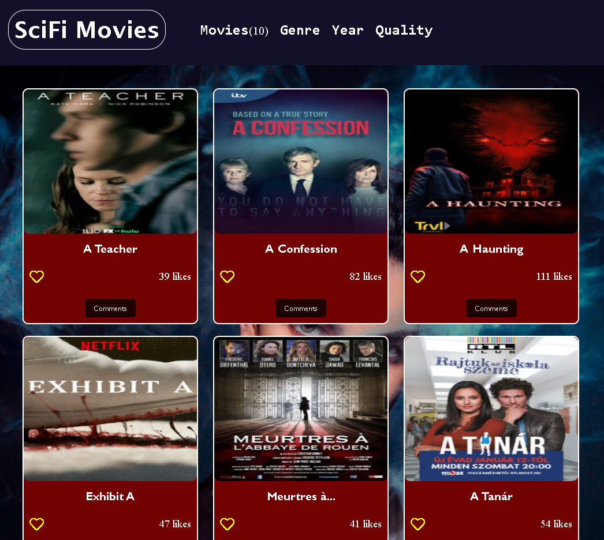
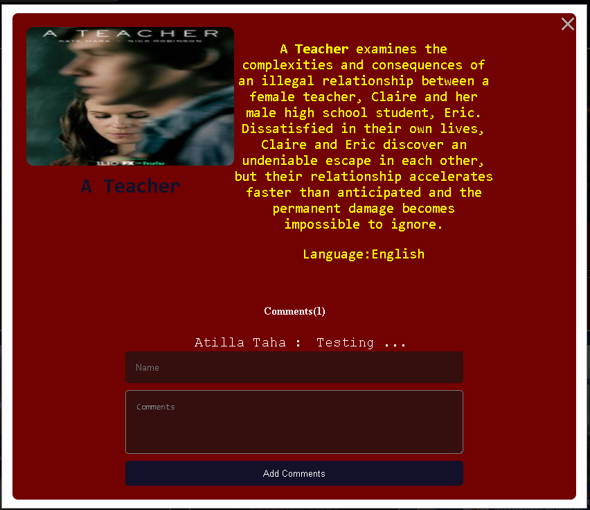

# Module 1: Capstone Project

> We made up Capstone Project with javascript 
> Our project get data from API and we can send data with another API





## Built With

- HTML5
- CSS3
- JavaScript
- Webpack
- JavaScript Jest

## Live Demo

[Live Demo Link]

## Presentation

[Video](https://drive.google.com/file/d/1ScaC0EKHTyW2RiK6ZG2eKTRjsOzttpyH/view)

## Getting Started

**To get a copy of this repo into your local machine run the following command:**
```
git clone  https://github.com/ishimwezachee/Capstone-project-2
cd Capstone-project-2
in visual studio code you can click the go live button to view it live in the browser.
```


## Authors

👤 **ATİLLA TAHA KÖRDÜĞÜM**

- GitHub: [@AtillaTahak](https://github.com/AtillaTahak)
- Twitter: [@AtillaTahaa](https://twitter.com/AtillaTahaa)
- LinkedIn: [LinkedIn](https://www.linkedin.com/in/atilla-taha-kördüğüm-a93702186/)
- Blog: [Blog](atillataha.blogspot.com)
- Youtube: [YouTube](https://www.youtube.com/channel/UCmoD0x4Z9vdG2PCsI5p8FYg)

👤 **Zachee Ishimwe**

- GitHub: [@ishimwezachee](https://github.com/ishimwezachee)
- Twitter: [@zachee250](https://twitter.com/zachee250)


## 🤝 Contributing

Contributions, issues, and feature requests are welcome!

Feel free to check the [issues page](../../issues/).

## Show your support

Give a ⭐️ if you like this project!


## 📝 License

This project is [MIT](./MIT.md) licensed.
